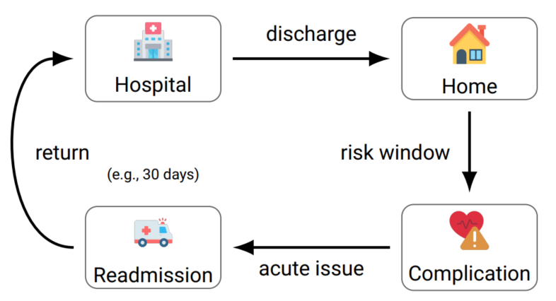
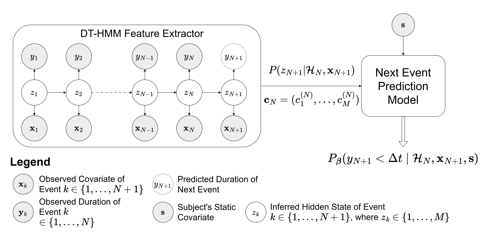
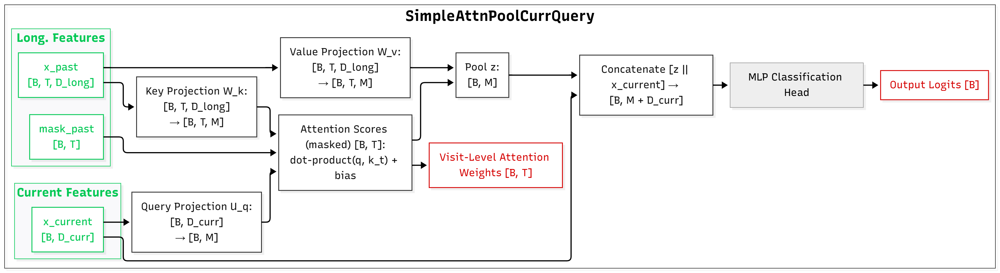

# Recurrent Health Events Prediction

This project investigates machine learning approaches for predicting recurrent health events—especially hospital readmissions—using structured clinical data. The repository contains code for two related works:

1. DT-HMM–based transfer learning (Master’s thesis, TU Darmstadt)
2. Attention-based deep learning models (Final Graduate Report / "TCC" at Poli-USP Brazil)

Both approaches are evaluated against baseline models using simple historical summary features (Logistic Regression, Random Forests, LightGBM).

## Motivation

Hospital readmissions can be defined as unplanned admissions to a hospital within a certain time frame (e.g., 30 days) after discharge from a previous hospitalization. These events are often costly, frequent, and often preventable. Accurately identifying patients at high risk of returning to the hospital shortly after discharge helps clinicians intervene earlier, improve patient outcomes, and reduce pressure on healthcare systems.



While traditional approaches rely on coarse historical features, many relevant temporal patterns in a patient’s clinical trajectory may be lost. This motivates the exploration of sequential modeling methods capable of capturing richer temporal information.

## Objectives

The DT-HMM–based transfer learning approach, developed in the Master’s thesis at TU Darmstadt, introduced an interpretable representation-learning method for patient trajectories. However, these features did not consistently outperform simple baselines.



Another work, performed at Poli-USP Brazil, extends this research by evaluating attention-based deep learning models as an alternative for extracting meaningful temporal patterns from longitudinal health data.



Together, the two main objectives of this project are:

1. Research Goal: Explore and compare sequential modeling techniques—DT-HMM and attention-based deep learning—against baseline models for predicting hospital readmission.
2. Practical Goal: Develop a prototype web application (FastAPI backend + Streamlit frontend) to demonstrate how such predictive models can be integrated into real clinical workflows.

## 📦 Project Setup

### 1. Clone the Repository

```bash
git clone git@gitlab.com:LucasVonAncken/master-thesis-recurrent-health-events-prediction.git
cd master-thesis-recurrent-health-events-prediction
```

### 2. Set Up the Virtual Environment with Poetry

Make sure you have [Poetry installed](https://python-poetry.org/docs/#installation).

To create a virtual environment **inside the project directory** (`.venv/`):

```bash
poetry config virtualenvs.in-project true --local
```

Then install dependencies:

```bash
poetry install
```

### 3. Activate the Environment

```bash
poetry shell
```

---

## 📦 Optional Setup: Using a Dev Container (Recommended for Reproducibility)

If you’re using Visual Studio Code and want a fully reproducible, OS-independent development environment, you can use the preconfigured Dev Container.

This ensures that all tools, dependencies, and Python versions are installed identically across machines — ideal for research and collaboration. 

⚠️ **Note**: The first build of the container may take a long time (e.g., ~20–25 minutes).This is normal — the container compiles Python from source and installs scientific libraries with native code. Subsequent launches will be much faster thanks to Docker caching.

### 🔧 To Use the Dev Container:

1. Install Docker Desktop

2. Install Visual Studio Code

3. Install the Dev Containers extension in VS Code

4. Open the project folder in VS Code

5. Press Cmd+Shift+P (Mac) or Ctrl+Shift+P (Windows/Linux)

6. Select: *Dev Containers: Reopen in Container*

VS Code will build the environment and reopen your project inside a fully configured container.

## 🚀 Running the Project

Once the environment is activated, you can run any of the project's main scripts. Check the `src/` folder.

---

## 💾 Downloading the MIMIC Dataset

To download the necessary [MIMIC](https://physionet.org/content/mimiciii/) files, run the following script:

```bash
bash scripts/download_mimic_files.sh
```

> 🔐 **Note:** You must have valid PhysioNet credentials and appropriate permissions to access the MIMIC dataset. Refer to the [official MIMIC documentation](https://physionet.org/content/mimiciii/view-only/) for instructions on how to gain access.

---

## 📁 Project Structure

```text
.
├── recurrent_health_events_prediction/   # Core source code for model training and prediction
├── app/                                  # Streamlit Web Application (Frontend)
├── api/                                  # FastAPI Backend serving model predictions
├── scripts/                              # Utility scripts (e.g., data preparation)
├── tests/                                # Automated tests (pytest)
├── docs/                                 # UML diagrams and backend documentation
├── assets/                               # Images, plots, and auxiliary files
│
│   # Local folders not tracked by Git
├── _models/                              # Trained models (deep learning, classical ML, HMMs)
├── _runs/                                # Training/evaluation runs and logs (e.g., TensorBoard)
├── _runs_optuna/                         # Hyperparameter optimization runs (Optuna)
│
├── pyproject.toml                        # Poetry project configuration and dependencies
├── poetry.lock                           # Locked dependency versions for reproducibility
└── README.md                             # Project documentation

```

---

## ✅ Requirements

- Python 3.9+
- Poetry
- Access to the MIMIC-III or MIMIC-IV dataset

---

## 📚 References

- [Poetry Documentation](https://python-poetry.org/docs/)
- [MIMIC Dataset Info](https://physionet.org/mimic/)
